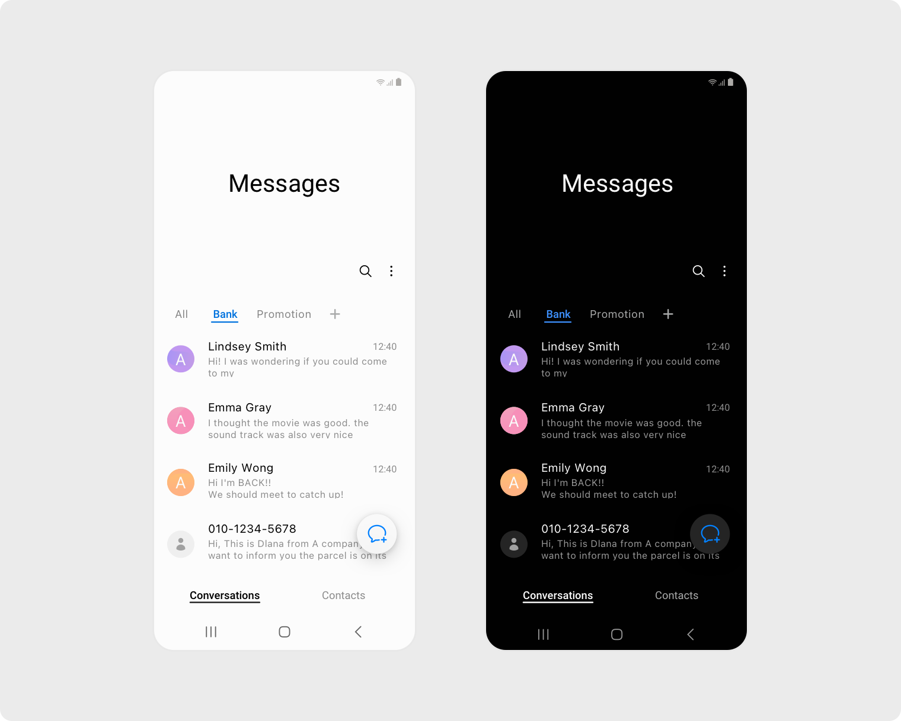
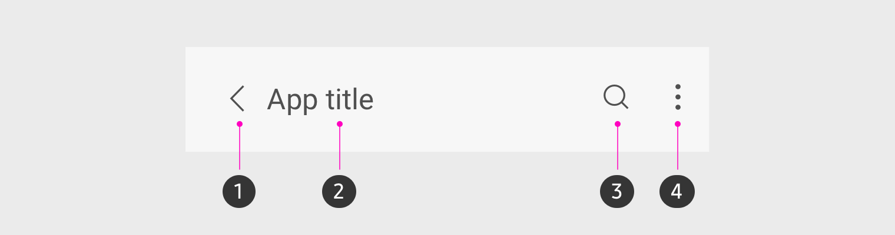
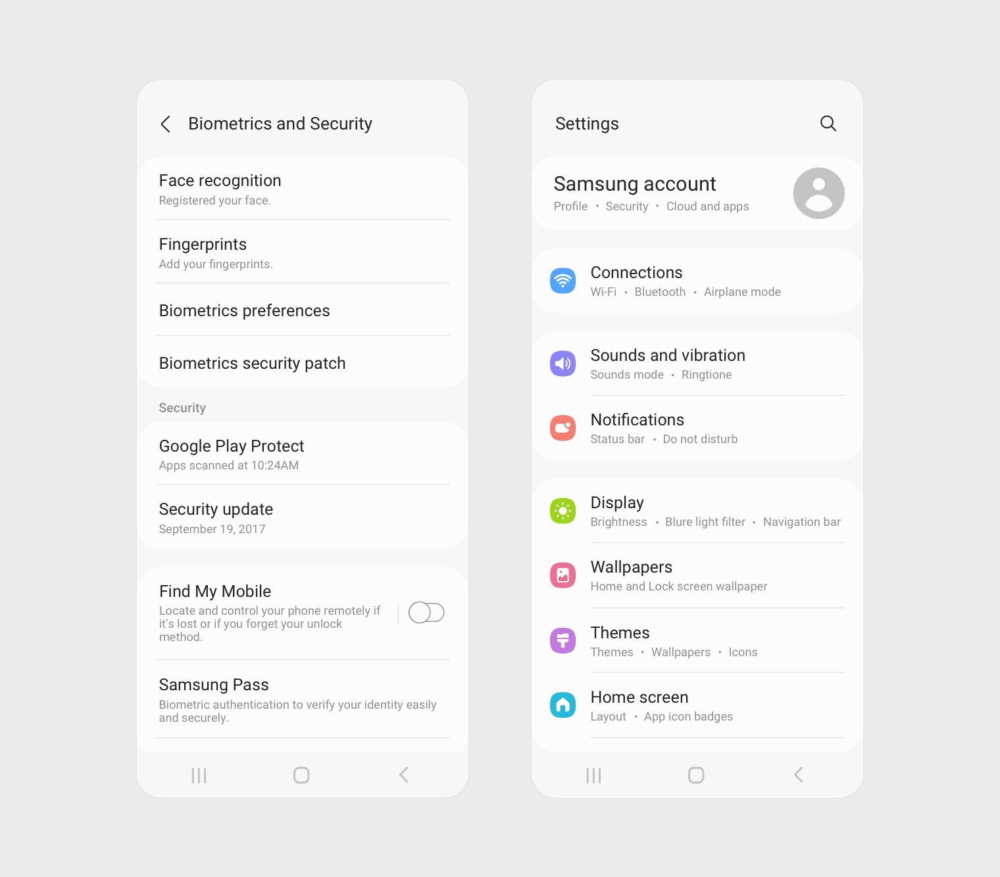
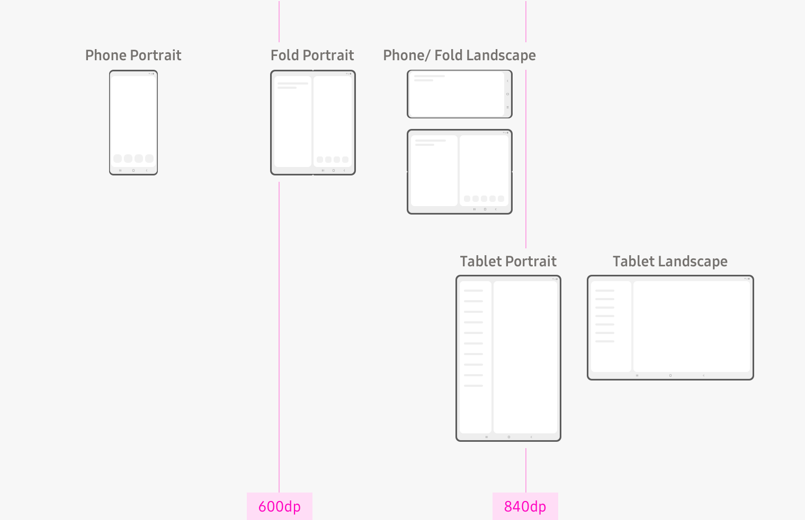

# One UI Messages — design research and migration audit

Date: 2026-08-31  
Project: `Сообщения` (`com.afkanerd.deku`)  
Scope: complete UI/UX replacement without changing the established E2EE, Data SMS or attachment protocol.

## TL;DR

Build a Compose-native One UI-inspired design system on top of the project's existing Material 3/Foundation stack. Do **not** add `oneui-design` or replace AndroidX with SESL in the production app. Both projects are useful references and permissively licensed, but their current implementation is View/XML-based, requires authenticated GitHub Packages, replaces core AndroidX artifacts, and is materially ahead of the project's toolchain.

The present UI is not a skinning job. The principal screens are large monoliths, mix Material 2 and Material 3, access Android `Context`, Telephony, preferences, crypto and attachment infrastructure directly, and pass persistence entities into composables. The correct migration is:

```text
Compose UI
   ↓ intents / immutable UI state
Presentation ViewModels
   ↓ application commands and flows
MessageService facade
   ↓
Domain (messages, transfers, secure sessions, settings)
   ↓
Transport / Room / Telephony / Crypto / files
```

The visible product should feel like Samsung Messages: large collapsible titles, quiet backgrounds, low-elevation rounded groups, important controls in the lower interaction zone, restrained blue accent, compact message bubbles and a two-pane list/detail layout from 600 dp. It must never render ciphertext, protocol frames, chunk counts, ports, ACK/NACK or ratchet terminology.

## Recommendation

### Product direction

1. Preserve all working messaging, encryption and attachment behaviour behind a new `MessageService` facade.
2. Introduce a small Compose design system (`MessagesTheme`, tokens and reusable primitives) rather than styling each screen independently.
3. Replace screens by vertical slice, starting with the shell and conversation list, then chat/composer, attachments/security, settings/details, and finally adaptive layouts and performance hardening.
4. Treat secure failures as a recoverable product state. Raw encrypted payloads are never shown. A failed decrypt becomes a neutral security event card with “Request a new key” and “Verify contact”.
5. Treat one attachment as one timeline entity through its entire lifecycle. Transfer internals are presentation-invisible.

### Proposed phone structure

```text
┌──────────────────────────────────────┐
│ status / viewing zone                │
│                                      │
│ Messages                             │  expanded title
│ 12 unread                            │
│                    search  more      │
├──────────────────────────────────────┤
│ [ Search messages                  ] │
│                                      │
│ ● Anna                      21:42     │
│   Photo · Sending 68%                 │
│                                      │
│ ● Bank                       18:03    │
│   Your verification code…        2   │
│                                      │
│                           (compose)   │
└──────────────────────────────────────┘
```

```text
┌──────────────────────────────────────┐
│ ‹  Anna                 call   more  │
│    Secure · Verified                 │
├──────────────────────────────────────┤
│              Today                   │
│                                      │
│  Hello!                              │
│                        Hi, how are…   │
│                        21:40 ✓        │
│                                      │
│  ┌ Photo ───────────────┐            │
│  │ preview              │            │
│  │ Receiving 68%   pause│            │
│  └──────────────────────┘            │
├──────────────────────────────────────┤
│  +  Message                 mic/send │
└──────────────────────────────────────┘
```

On a window width of 600 dp or more, the conversation list stays visible beside the selected chat. At 840 dp and above, the list pane gets its full navigation/search treatment and the detail pane receives a bounded readable width.

## Evidence from official One UI guidance

Samsung describes four principles: focus on the task, natural interaction, visible comfort and responsive layouts. The most consequential rule for this app is the split between a viewing area above and an interaction area below, which keeps controls reachable on tall devices.



The official Messages example uses a large quiet title region, search/more actions close to content, restrained blue emphasis, flat list rows and true black in dark mode. The migration should copy the hierarchy and interaction logic, not Samsung assets or proprietary code.



An extended app bar should collapse as content scrolls, persist its expanded/collapsed state, and contain no more than three visible actions. Conversation detail uses the condensed form because vertical space belongs to the timeline.



Settings use scan-friendly groups, short nouns or verb phrases, switches on the trailing edge, and supporting copy only when it resolves ambiguity. The current flat list should become rounded section containers with quiet subheaders.



Samsung's documented window classes are compact below 600 dp, medium from 600 to 839 dp, and expanded at 840 dp. Messages maps naturally to list/detail panes.

## Current-state audit


The captured screen already exposes several migration priorities: the centred toolbar wastes the One UI viewing zone; the old product name “Deku SMS” leaks through localisation; the illustration dominates the task; the primary CTA is visually disabled-looking; privacy is separated to the extreme bottom; and the screen is not a focused progressive permission flow.

Static inspection found roughly 10k lines in the main UI surface. The largest files are `ConversationsComponents.kt` (1,153 lines), `ThreadsConversation.kt` (1,073), `ConversationsMain.kt` (813), `ThreadsConversationMain.kt` (672) and `ContactDetailsMain.kt` (591). These sizes are symptoms of mixed responsibilities, not merely formatting.

### KEEP

| Area | Keep | Boundary after migration |
|---|---|---|
| Paging/Room flows | Existing paging concept and database queries | Repositories expose domain models; UI never opens Room via `Context`. |
| E2EE and recovery work | Existing ratchet/session implementation, renewal command and verified identity data | Security domain maps it to `SecurityUiState`. |
| Attachment pipeline | Existing manifest, encrypted transfer, retries, resume, integrity checks and persistence | Exposed as one `AttachmentTimelineItem` and high-level actions. |
| Localisation | Existing translated strings that are accurate | Rename stale “Deku SMS”; add complete One UI/security/transfer copy. |
| Navigation destinations | Functional destination set | Replace stringly/argument-heavy UI wiring with typed route models where practical. |
| Paging scale | Existing `PagingSource`/`PagingData` foundation | Stable IDs/content types and no expensive work in item composition. |

### REWRITE

| Screen/component | Why | New form |
|---|---|---|
| `DefaultCheckMain.kt` | Old name, oversized illustration, mixed top bar and onboarding, weak CTA hierarchy | Focused onboarding with one task per page, progress, rationale and retry state. |
| `ThreadsConversationMain.kt` | 672-line screen, multiple app bars, direct platform state, weak One UI hierarchy | Extended One UI list shell with pinned/archived filters, search and adaptive detail pane. |
| `ConversationsMain.kt` | Instantiates `SmsManager`, knows Telephony/prefs, owns too many interaction modes | Stateless chat route fed by a single immutable `ConversationUiState`. |
| `ConversationsComponents.kt` and `ThreadsConversation.kt` | Giant mixed component files, Material 2/3 overlap, persistence models in UI | Small primitives: thread row, bubble family, day marker, status marker, composer. |
| `ComposeNewMain.kt` | Sends SMS directly from a contact row | Recipient picker emitting a presentation intent. |
| `ContactDetailsMain.kt` | Large monolith and direct preference writes | One UI contact header + action cards + media/security/settings groups. |
| `SettingsMain.kt` | Reads/writes preferences inside composition | Sectioned screen driven by `SettingsUiState` and events. |
| `SearchMain.kt` | Generic list without scoped result types | Unified search with people/conversations/messages sections and highlighted terms. |
| `MediaMain.kt` | Generic scaffold/bottom bar | Media/files/links tabs, empty/loading/error states and adaptive grid. |
| Security modal/panel/key exchange | UI imports `EncryptionController` enums and parses protocol messages | Domain-neutral state: Off, Establishing, SecureUnverified, Verified, Changed, RecoveryRequired. |
| Attachment composer/thread content | UI constructs `AttachmentManager`, reads chunk tracker and creates `MediaPlayer` | Attachment presentation controller + bottom sheet + photo/voice/file bubbles. |
| Theme files | Generated Material palette in `com.example.*`, 312-line theme, default dynamic colour | Purpose-built One UI tokens under the app namespace. |

### REMOVE

| Item | Reason |
|---|---|
| `egs_cyberpunk2077_…webp` | Unrelated 224 KB artwork; inconsistent with Messages and likely unused. |
| Duplicate launcher artwork in the vendor library | A library must not ship application branding resources. |
| Direct Material 2 components in the new UI | Mixing Material 2/3 produces inconsistent metrics, menus and dialogs. |
| Duplicate app-level/vendor developer screens | One canonical destination; developer-only surfaces remain behind a debug flag. |
| Raw crypto/control-message rendering paths | Ciphertext and key/control frames must map to secure system events or be hidden. |
| Ad-hoc per-screen colours, radii and spacing | Replaced by tokens. |
| Stale `com.example.compose` / `com.example.ui.theme` packages | Theme ownership must be explicit and app-scoped. |

### MOVE TO DOMAIN / SERVICES

| Current leak | Target API |
|---|---|
| `SmsManager`, `sendSms`, `sendMms`, subscription and Telephony constants | `MessageService.sendText`, `sendMedia`, `retry`, `availableSubscriptions`. |
| `EncryptionController` enums and direct `sendRequest`/`renewSession` | `SecureSessionService.request`, `accept`, `renew`, `verify`, `observeState`. |
| Raw key-exchange message parsing | Domain maps control frames to `SecurityEvent`; never a normal bubble. |
| `AttachmentManager`, chunk tracker, protocol status strings | `AttachmentService.observeTimeline`, `send`, `accept`, `pause`, `resume`, `cancel`, `retry`. |
| Direct `getDatabase()` calls in ViewModels | Repositories injected into use cases/services. |
| Preference extension calls in composables | `SettingsRepository` + `SettingsViewModel`. |
| Contact/provider/block/mute/archive operations | `ConversationActionsService`. |
| Date, grouping, SIM and delivery-status computation inside rows | Presentation mappers producing immutable, precomputed UI models. |
| `MediaPlayer` lifecycle in bubbles | `VoicePlaybackController` with one active item and observable playback state. |
| Android `Toast` from ViewModels | One-shot presentation effects or snackbar events. |

## Library decision

| Option | Strengths | Risks | Decision |
|---|---|---|---|
| `tribalfs/oneui-design` 0.9.19+oneui8 | Closest open-source One UI widgets; MIT; minSdk 24 | View/XML, not Compose; brings the entire SESL bundle, camera/ML dependencies; GitHub token required; current main uses compileSdk 37.1, AGP 9.3.2, Kotlin 2.4.10 and JVM 21 | Research/reference only. |
| `tribalfs/sesl-androidx` SESL8 | Apache-2.0; authentic One UI behaviours for classic Views; modules cover appcompat, RecyclerView, Preference, pickers | Replaces official AndroidX and requires extensive exclusions; authenticated GitHub Packages; mixed target/compile levels; duplicate-class and transitive compatibility risk in a Compose app | Do not adopt for production migration. |
| Compose Material 3 + custom tokens/primitives | Already present; works with Paging, adaptive layouts and accessibility; reproducible Google Maven builds | Requires deliberate recreation of One UI metrics and behaviours | Selected. |

Compatibility details were verified against repository source, not inferred from README screenshots. The current project is minSdk 24/targetSdk 36/compileSdk 36 with Kotlin 2.3.x; the vendor UI already uses Compose and Material 3. SESL's own README requires excluding official AndroidX equivalents to prevent duplicate classes. That is disproportionate risk for visual fidelity that can be achieved at the Compose layer.

## Design system specification

### Colour

- App accent: accessible blue, nominal light `#006FFD`, dark `#4DA3FF`; use only for selected state, send/progress and links.
- Light background `#F7F7F7`, primary surface `#FFFFFF`, grouped surface `#F1F1F3`, primary text `#1C1C1E`.
- Dark background `#000000`, primary surface `#151515`, grouped surface `#202124`, primary text `#F5F5F5`.
- Semantic colours are tokenised separately: success, warning, error, secure, transfer and neutral. Never communicate status through colour alone.
- System dark/light is default. Manual light/dark overrides remain in settings. Dynamic colour is opt-in and limited to the accent family; it must not recolour security/error semantics or damage bubble contrast.

### Typography

- Use the platform sans-serif family. Do not bundle Samsung One or copy proprietary font assets.
- Large screen title: 36–40 sp, normal/medium weight; collapses to 20 sp.
- Conversation title: 20 sp; body 16–17 sp; metadata 12–13 sp; labels 14 sp.
- Support 200% font scale without clipping core actions. Titles, composer and setting rows must grow vertically instead of forcing a single line.

### Spacing and shapes

- Spacing scale: 4, 8, 12, 16, 20, 24, 32, 48 dp.
- Minimum interactive target: 48 × 48 dp, with 8 dp separation between adjacent destructive/primary actions.
- Group cards: 24–28 dp radius. Bottom sheets/dialogs: 28–32 dp. Composer: 24 dp.
- Bubbles: 18–20 dp outer corners and 5–7 dp corner toward the speaker; consecutive messages tighten vertically and share grouping logic.
- Avoid elevation-heavy cards. Prefer calm surface contrast and thin dividers within groups.

### Motion and haptics

- 100–140 ms for icon/status feedback, 180–220 ms for bubble/composer changes, 260–320 ms for sheets and navigation.
- Preserve spatial continuity: new foreground surfaces dim the old surface; avoid simultaneous text cross-fades that reduce readability.
- Animate only state transitions (send, receive, expand, progress completion), not passive decoration.
- Respect system animator duration/reduced motion. Haptics are subtle and limited to send, long-press selection, recording start/stop and destructive confirmation.

### Core primitives

- `OneUiLargeTopBar`, `OneUiCompactTopBar`
- `OneUiSearchField`, `OneUiSection`, `OneUiSettingsRow`
- `ConversationRow`, `UnreadBadge`, `SecureBadge`, `DeliveryMark`
- `MessageBubble` variants: Text, Photo, Voice, File, System, SecurityEvent, Transfer
- `MessageComposer`, `AttachmentSheet`, `VoiceRecorder`
- `SecurityStatusCard`, `IdentityVerificationSheet`
- `EmptyState`, `LoadingState`, `InlineError`, `BlockingError`
- `MessagesListDetailScaffold`

## Conversation and transfer rules

### Bubble grouping

- Group consecutive messages from the same sender when separated by no more than two minutes and without a day/security/system boundary.
- Show timestamp/status once at the end of a group unless failure or transfer state requires immediate visibility.
- Keep the maximum text bubble width near 78% on compact phones and cap it to a readable measure on tablets.
- Security and system events are centred, neutral and never mimic peer-authored messages.

### Attachments

- The timeline key is the logical transfer/message ID, never a frame/chunk ID.
- Photo: preview, total size, circular progress, pause/resume/cancel/retry, tap-to-open after verification.
- Voice: waveform or simple bars, duration, play/pause, seek, speed only if reliable; recording lives in the composer and has cancel/send affordances.
- File: type icon, filename, human-readable size, progress and action.
- The UI uses product states such as “Preparing”, “Waiting for acceptance”, “Sending 68%”, “Paused”, “Checking”, “Failed — retry”, “Received”. It never says chunk, ACK, port, Data SMS or AES-GCM.

### Security

- Header states: Secure & verified; Secure, not verified; Setting up; Keys changed; Recovery needed; Not secure.
- A changed identity is high salience and requires explicit acknowledgement/verification before the “verified” treatment returns.
- Decrypt failure never falls back to ciphertext. Render “This message could not be decrypted” as a security event with actions to request a new key and verify the contact.
- Key request progress is human: “Request sent”, “Waiting for Anna”, “Secure connection restored”. Automatic safe recovery may run in the background, but repeated/identity-changing recovery asks the user.

## Screen-by-screen migration order

1. **Foundation and service boundary** — UI models, `MessageService`, theme/tokens, primitives, test fixtures.
2. **App shell and onboarding** — default SMS role, permissions, import progress/errors, no stale brand.
3. **Conversation list and search** — extended title, grouped actions, paging, archive/pin/unread and empty states.
4. **Chat and composer** — bubble family, grouping, send/delivery/failure states, SIM selector and draft restoration.
5. **Attachments and voice** — sheet, previews, one-entity transfer bubbles, playback/recording controller.
6. **Security and key exchange** — domain-neutral status model, identity screen, recovery UX and hidden control frames.
7. **Contact details, media and settings** — One UI groups, notification/SIM/security controls and theme choices.
8. **Adaptive/accessibility/performance** — 600/840 dp panes, font scale, TalkBack, keyboard, 50k-message test data and macrobenchmarks.

## Acceptance gates

- UI packages contain no imports of `android.telephony.SmsManager`, protocol frame/chunk classes, Double Ratchet controller or crypto storage.
- No ciphertext/control frame appears in UI, logs intended for users, notifications or share/copy actions.
- One logical attachment produces exactly one timeline item across restart/retry/resume.
- Debug, release and minified release build on a clean checkout without personal GitHub credentials.
- Lint, unit tests and Compose UI tests cover light/dark, 200% font scale, compact/medium/expanded windows, RTL, empty/loading/error and security mismatch states.
- Paging is demonstrated with 50,000 messages; rows have stable keys/content types; expensive formatting and decoding happen outside composition.
- Android 16 edge-to-edge, predictive back, permissions and role flows are verified on device.
- TalkBack announces sender, content type, transfer/security status and available action exactly once per logical message.

## Sources

- Samsung One UI overview: https://developer.samsung.com/one-ui/index.html
- Samsung app bar: https://developer.samsung.com/one-ui/comp/app-bar.html
- Samsung lists: https://developer.samsung.com/one-ui/comp/list.html
- Samsung colour system: https://developer.samsung.com/one-ui/color/system.html
- Samsung motion: https://developer.samsung.com/one-ui/motion/basic.html
- Samsung accessibility typography: https://developer.samsung.com/one-ui/accessibility/layout-and-typo.html
- Samsung large-screen layouts: https://developer.samsung.com/one-ui/largescreen-and-foldable/large_screen_layout.html
- `oneui-design` source and MIT licence: https://github.com/tribalfs/oneui-design
- `sesl-androidx` source and Apache-2.0 licence: https://github.com/tribalfs/sesl-androidx
- Android adaptive Compose guidance: https://developer.android.com/develop/ui/compose/layouts/adaptive/get-started-with-adaptive-apps
- Android Compose performance: https://developer.android.com/develop/ui/compose/performance/bestpractices
- Android Compose accessibility: https://developer.android.com/develop/ui/compose/accessibility

## Research limitations

The Lazyweb connector and local browser-capture tooling were unavailable in this session, so competitive screenshot retrieval was limited to official Samsung documentation plus a directly captured screenshot from the connected test phone. No unaudited third-party visual assets are recommended for shipping.

