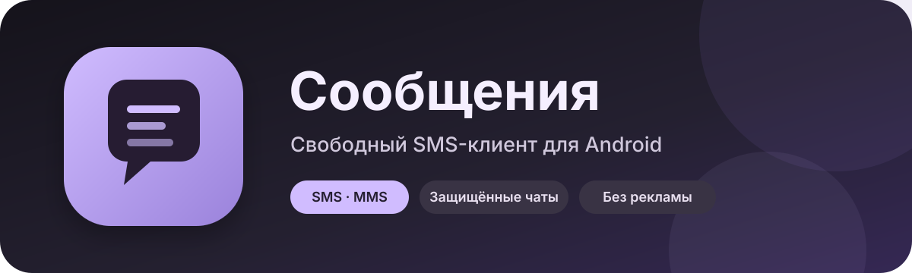
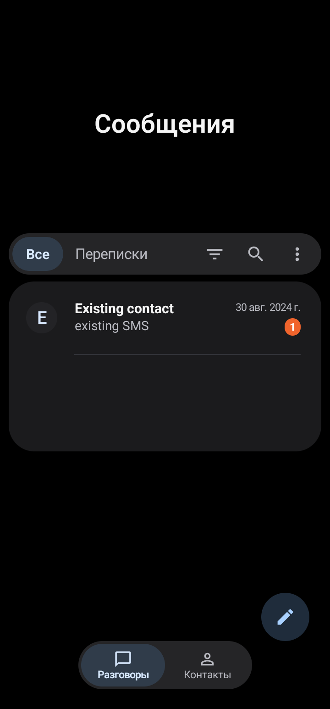
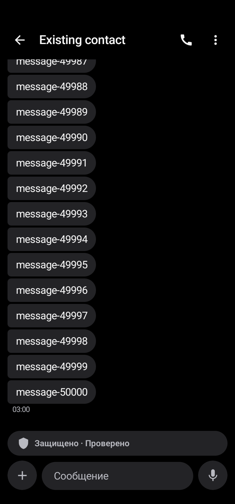
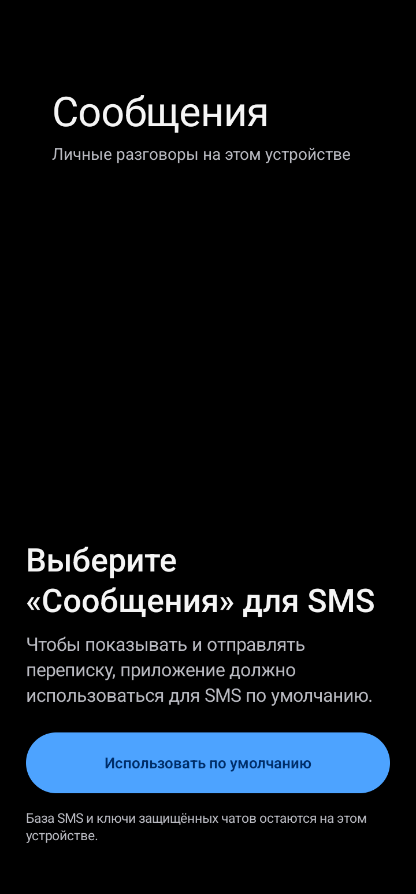

<p align="center">
  
</p>

<p align="center">
  <a href="https://github.com/IgorNadein/Messages/releases/latest"></a>
  <a href="https://github.com/IgorNadein/Messages/actions/workflows/android-release.yml"></a>
  
  <a href="LICENSE"></a>
</p>

<p align="center">
  <strong>SMS и MMS без рекламы, с современным интерфейсом, защищёнными чатами и расширяемой доставкой.</strong>
</p>

<p align="center">
  <a href="https://github.com/IgorNadein/Messages/releases/latest"><strong>Скачать APK</strong></a> ·
  <a href="https://github.com/IgorNadein/Messages/issues/new?template=bug_report.md">Сообщить о проблеме</a> ·
  <a href="docs/media-transport-architecture.md">Архитектура медиа</a>
</p>

## О приложении

**Сообщения** — независимое развитие открытого Android-клиента [DekuSMS](https://github.com/deku-messaging/Deku-SMS-Android). Приложение может работать как основной SMS-клиент, хранит переписку локально и использует системную базу Android для совместимости с другими приложениями.

| Повседневное общение | Защита и медиа | Интеграции |
| --- | --- | --- |
| SMS, MMS, групповые диалоги, поиск, архив и закрепление | Сквозное шифрование с Double Ratchet, фото, файлы и голосовые сообщения | HTTP(S), FTP/SFTP, SMTP, RabbitMQ и собственные облачные хранилища |
| Поддержка нескольких SIM-карт | Выбор MMS, Data SMS, совместимых SMS-пакетов или интернет-хранилища | Телефон как SMS-шлюз и маршрутизация входящих сообщений |

> Защищённые сообщения и специальные способы передачи медиа требуют совместимого приложения у собеседника. Обычные SMS и MMS продолжают работать стандартным способом и могут тарифицироваться оператором.

## Интерфейс

<table>
  <tr>
    <th>Входящие</th>
    <th>Защищённый диалог</th>
    <th>Первый запуск</th>
  </tr>
  <tr>
    <td></td>
    <td></td>
    <td></td>
  </tr>
</table>

## Скачать и обновить

Откройте [последний выпуск](https://github.com/IgorNadein/Messages/releases/latest) и выберите файл `Messages-….apk` в разделе **Assets**. Поддерживается Android 7.0 и новее.

После первой установки обновления доступны прямо в приложении: **Настройки → Обновления**. Приложение проверяет стабильный GitHub Release, загружает APK с отображением прогресса и перед установкой сверяет размер, контрольную сумму, пакет, номер версии и сертификат подписи. Установку всегда подтверждает системный установщик Android; сообщения и настройки при обновлении сохраняются.

> APK другого издателя или сборка с другой подписью не сможет обновить уже установленное приложение. Это штатная защита Android.

## Собрать из исходников

Нужны JDK 17 или 21 и Android SDK 36. Из корня проекта:

```bash
./gradlew :app:assembleDebug
```

Отладочные APK появятся в `app/build/outputs/apk/debug/`. Debug-сборка устанавливается отдельно с суффиксом `.audit` и не заменяет опубликованную версию.

Проверки JVM:

```bash
./gradlew :app:testDebugUnitTest
```

[Подпись и выпуск APK](docs/github-updates.md) · [Архитектура передачи медиа](docs/media-transport-architecture.md) · [Матрица регрессий](REGRESSION_MATRIX.md)

## Происхождение и лицензия

Проект основан на DekuSMS и сохраняет историю и уведомления об авторских правах исходного проекта и его зависимостей. Исходный код распространяется по [GNU GPL v3](LICENSE). Название, оформление и новые изменения этого форка не означают одобрения со стороны авторов DekuSMS.

---

[Разработчик — IgorNadein](https://github.com/IgorNadein) · [Issues](https://github.com/IgorNadein/Messages/issues) · [Все выпуски](https://github.com/IgorNadein/Messages/releases)
